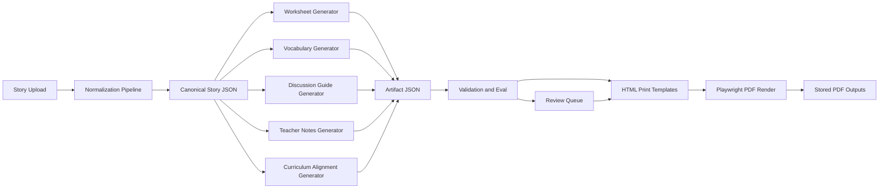

# Architecture

## Outcome

Build an application that can:

1. ingest a large number of stories and one illustration per story
2. generate teacher-support artifacts from reusable prompt families
3. output print-ready PDFs matching the ASAD worksheet format
4. support regeneration, versioning, review, and scale

## System Overview



## Key Architectural Decisions

### 1. Canonical story model first

Every story should be converted into one internal semantic JSON record before any downstream material generation happens.

Why:

- avoids repeating story parsing logic in every prompt family
- keeps terminology consistent across worksheets, notes, and curriculum summaries
- makes regeneration deterministic
- allows evaluation at the semantic layer before layout is involved

### 2. Structured generation, not freeform generation

Each prompt family must emit schema-valid JSON.

Why:

- layout code becomes predictable
- easier to QA and diff output changes
- better batch reliability
- easier review tooling

### 3. Deterministic print rendering

Use HTML/CSS templates and Playwright PDF export as the primary rendering path.

Why:

- strongest control over typography and page layout
- easier to match existing worksheet examples
- simpler designer/developer collaboration
- reusable print templates across artifact types

Add Paged.js only if browser print CSS becomes insufficient for advanced paged-media features.

### 4. Version everything

Each generated artifact should store:

- source story version
- prompt family name
- prompt version
- schema version
- model version
- layout version
- generation timestamp

This is required for reliable regeneration, comparison, rollback, and review.

## Services

## 1. Ingestion service

Responsibilities:

- accept story text and metadata
- accept illustration upload
- validate file formats
- deduplicate by content hash
- persist raw assets
- trigger normalization job

Suggested inputs:

- title
- story text
- language
- optional age band
- optional tags
- illustration file

## 2. Normalization service

Responsibilities:

- create canonical story JSON
- extract basic semantic structure
- create stable derived metadata
- store source hash and normalized version

Outputs:

- canonical story record
- extraction confidence
- normalization warnings

## 3. Generation service

Responsibilities:

- call prompt-family generators
- enforce schemas
- store JSON outputs
- rerun jobs when prompt versions change
- support async and batch generation

This service should use:

- OpenAI Responses API with Structured Outputs for normal generation
- Batch API for large imports or full re-generation

## 4. Evaluation service

Responsibilities:

- schema validation
- content policy checks
- quality heuristics
- duplicate detection
- reading-level checks
- curriculum completeness checks
- scoring and review routing

Outputs:

- pass/fail
- confidence score
- review reasons

## 5. Rendering service

Responsibilities:

- convert artifact JSON into print HTML
- apply design tokens and worksheet templates
- render PDF with Playwright
- generate PNG previews for review

## 6. Review service

Responsibilities:

- compare JSON, preview, and final PDF
- mark approved/rejected
- capture editorial notes
- support regeneration with changed prompt/layout versions

## Data Flow

### Phase A: Story setup

1. User uploads story and illustration.
2. System stores raw assets and metadata.
3. Normalization job produces canonical story JSON.

### Phase B: Artifact generation

1. Orchestrator chooses prompt families required for the task.
2. Generators produce schema-valid artifact JSON.
3. Evaluator checks output quality.
4. Good outputs proceed automatically.
5. Low-confidence outputs enter review.

### Phase C: Publishing

1. Artifact JSON is mapped into a print template.
2. HTML preview is generated.
3. PDF is rendered.
4. Files are stored with version metadata.

## Prompt Family Responsibilities

## `ASAD_SAGA_MATERIAL_GENERATOR`

Use as orchestration/meta logic.

Responsibilities:

- decide which artifact families to run for a given task
- pass the correct canonical story fields downstream
- attach shared generation context

It should not own layout.

## `ASAD_WORKSHEET_FORMAT_STANDARD`

Responsibilities:

- standard worksheet structure
- section order
- instruction style
- question grouping rules

This is a content-contract generator, not a visual renderer.

## `ASAD_PRINTABLE_PDF_LAYOUT`

Responsibilities:

- layout configuration and template mapping
- page-level component placement
- variant selection for worksheet type

This should mostly live in code and design tokens, not in model reasoning.

## `ASAD_LEVEL_DIFFERENTIATION`

Responsibilities:

- produce Level 1, Level 2, Mixed, and future creative variants
- adjust complexity without changing core story focus
- keep terminology stable across levels

## `ASAD_VOCABULARY_EXTRACTOR`

Responsibilities:

- identify relevant vocabulary
- provide student-friendly definitions
- attach text evidence or usage context
- optionally group by difficulty or teaching priority

## `ASAD_DISCUSSION_GUIDE`

Responsibilities:

- oral discussion prompts
- talk moves
- sentence starters
- follow-up prompts
- whole-class/pair/small-group variants

## `ASAD_TEACHER_NOTES_GENERATOR`

Responsibilities:

- lesson purpose
- suggested pacing
- pre-reading and post-reading guidance
- likely misconceptions
- differentiation notes
- extension ideas

## `ASAD_CURRICULUM_ALIGNMENT`

Responsibilities:

- map content to curriculum targets
- explain why the mapping is valid
- include confidence and evidence

## Storage Model

## Postgres

Suggested tables:

- `stories`
- `story_versions`
- `assets`
- `canonical_story_records`
- `artifact_jobs`
- `artifact_versions`
- `prompt_versions`
- `layout_versions`
- `artifact_reviews`
- `rendered_outputs`

## Object storage

Store:

- original uploads
- generated JSON snapshots
- rendered HTML snapshots
- preview PNGs
- final PDFs

## Suggested MVP

Start with four outputs:

- Worksheet Level 1
- Worksheet Level 2
- Worksheet Mixed
- Teacher Notes

Reason:

- enough to prove ingestion, structured generation, level differentiation, and print rendering
- avoids spreading effort too thin across all prompt families

## Phase 2

Add:

- vocabulary sheets
- discussion guides
- curriculum alignment
- answer sheets
- creative tasks
- human review workflow
- batch regeneration UI

## Recommended Repository Structure

```text
ASAD/
  apps/
    api/
    web/
    worker/
  packages/
    prompts/
    schemas/
    renderer/
    design-system/
    evals/
  docs/
  samples/
```

## First Build Sequence

1. Define canonical story schema.
2. Define worksheet and teacher notes schemas.
3. Build one deterministic print template.
4. Build one generation path from story to worksheet JSON.
5. Add PDF rendering.
6. Add evaluation and review hooks.

That is the shortest path to a usable system.
